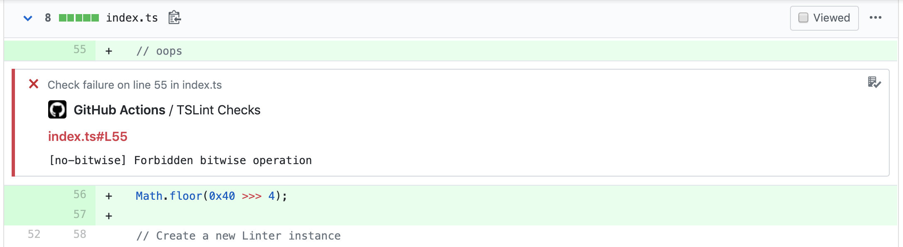

# tslint-actions

[](https://github.com/mooyoul/tslint-actions/actions)
[](https://github.com/semantic-release/semantic-release)
[](https://renovatebot.com/)
[](http://mooyoul.mit-license.org/)

GitHub action that lints your code with TSLint (with Annotation support)




## Sample Outputs

Please see [PR #2](https://github.com/mooyoul/tslint-actions/pull/2/files), or [Check Run Result](https://github.com/mooyoul/tslint-actions/pull/2/checks?check_run_id=228522505) 

## Sample Github Actions Configuration 

```yaml
name: workflow
on: [push]
jobs:
  job:
    runs-on: ubuntu-latest
    timeout-minutes: 3
    steps:
      - uses: actions/checkout@v1
      - name: Prepare
        run: npm ci
      - name: Lint
        uses: mooyoul/tslint-actions@v1.1.1
        with:
          token: ${{ secrets.GITHUB_TOKEN }}
          pattern: '*.ts'
```

## License

[MIT](LICENSE)

See full license on [mooyoul.mit-license.org](http://mooyoul.mit-license.org/)
